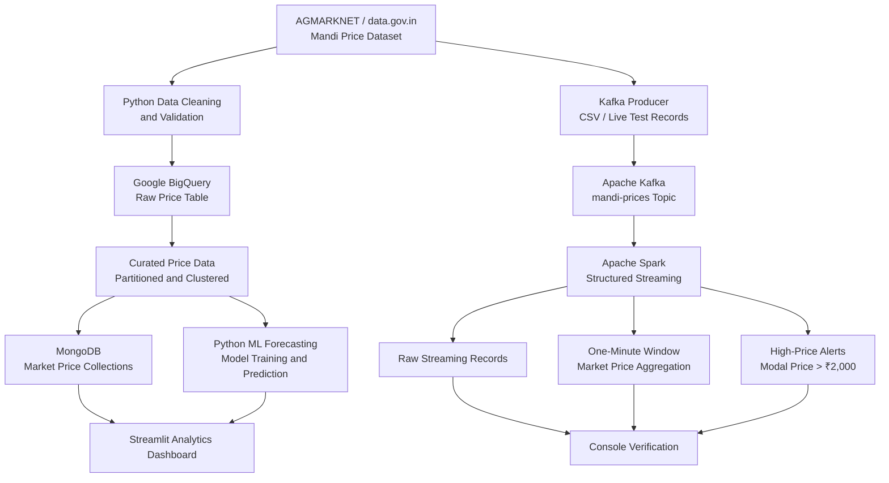

# Agricultural Market Price Intelligence – System Architecture

```mermaid
flowchart TB
    A["AGMARKNET / data.gov.in<br/>Mandi Price Dataset"]

    A --> B["Python Data Cleaning<br/>and Validation"]

    B --> C["Google BigQuery<br/>Raw Price Table"]
    C --> D["Curated Price Data<br/>Partitioned and Clustered"]

    D --> E["MongoDB<br/>Market Price Collections"]
    D --> F["Python ML Forecasting<br/>Model Training and Prediction"]

    E --> G["Streamlit Analytics Dashboard"]
    F --> G

    A --> H["Kafka Producer<br/>CSV / Live Test Records"]
    H --> I["Apache Kafka<br/>mandi-prices Topic"]
    I --> J["Apache Spark<br/>Structured Streaming"]

    J --> K["Raw Streaming Records"]
    J --> L["One-Minute Window<br/>Market Price Aggregation"]
    J --> M["High-Price Alerts<br/>Modal Price > ₹2,000"]

    K --> N["Console Verification"]
    L --> N
    M --> N
```
